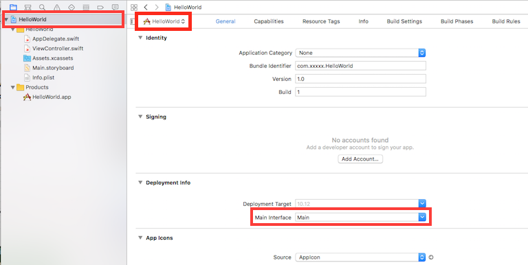

欢迎回到《macOS开发入门教程》！
- 1.在第一部分教程中，我们学习了如何获得macOS app开发所需的工具，以及探索Xcode，学习了如何构建和运行macOS app以及UI设计。  
- 2.在第二部门教程中，我们将在Xcode中剖析macOS app的组件。 从macOS app启动的方式，到UI如何构建再而如何用户处理交互进行一个系统性了解。  
- 3.在最后部分你将自己上手操作，从无到有的建立你的第一个macOS app。  

本文面向完整本系列教程第一部分学习的或者有Xcode使用经验的开发者。我们假定你对macOS app的体系结构了解甚少，如果您已经熟悉macOS的体系结构，那么您可能需要跳过，直到跳到最后一部分。  
在本文末尾你将打下一个良好的基础，对macOS app的不同部分如何结合有一个初步的理解，即使可能不知道它们各自如何工作。  

---
***提示：*** *本部分只是讲解macOS app工作原理的背景信息，不涉及代码编写。*  
*只需要坐下来轻松的学习，我们再下一个部分才会编写代码。*  
## macOS app如何启动？
让我们从macOS app的启动来开始我们的学习，在app启动时有三个组件需要我们注意：  
- 1.**AppDelegate.swift**：代码运行的入口， `AppDelegate.swift` 是一个很重要的文件，负责提供app在整个生命周期中（启动、闲置、进入后台、进入前台、激活、完全退出）与操作系统交互的方法。在运行代码时为你提供来自macOS的通知，例如Handoff请求、命令行参数和推送通知等。  
- 2.**Main.storyboard**：故事板具有指定的“入口点”，这允许系统在app启动时构建UI，这个入口点如图所示：  

   

   

你可以很清晰的看出来哪些场景将构建出app的初始UI界面。  
- 3.**Info.plist**：在一个app中可以有多个storyboard，那么macOS怎么知道用哪一个来构建初始UI呢？我们可以在 `Info.plist` 文件中向操作系统提供这个信息，如下图：  

   

   

`Info.plist` 文件包含了大量有用的app配置选项，其中许多可以通过Xcode的目标配置面板显示。下图显示了如何在更友好的界面中进行同样的初始storyboard配置：  

   

   

启动app比较复杂，但这对三个文件的解释您可以了解在哪里交互和配置app的启动选项。现在你已经让你的app运行了，是时候来看看一个非常重要的东西了——app的用户界面UI。  

## 用户界面UI（User interface）
你已经知道app的UI界面是有故事板 `storyboard` 提供的，在本节中我们将了解不同的UI组件，它们能够提供的效果以及它们如何组织在一起。

### Window
你的macOS app可能有一个或多个窗口对象（window objects），窗口就是app负责提供UI组件的一块屏幕区域。当用户更改app的窗口位置或大小时，macOS通过一个window manager来处理。  
除了表现app的可视化外观，窗口对象还处理用户使用鼠标和键盘在进行用户交互（user interaction）时所触发的用户事件（user events）。  
尽管可以直接与窗口对象（window objects）交互，但是通常窗口对象由窗口控制器（window controllers）管理，特别是在与故事板（storyboards）结合使用的时候。  
窗口控制器负责加载窗口对象本身，并允许你在窗口运行周期中挂载不同的事件。  
故事板包含至少一个窗口控制器，如图：  

   

   

窗口控制器（window controllers）是通过NSWindowController类（NSWindowController class）来表现的。当你在配置不同的窗口时，通常要创建不同的子类（subclasses）来实现不同的需求。
### Views
### View Controllers
### Viewing collections
### Handling user interaction
